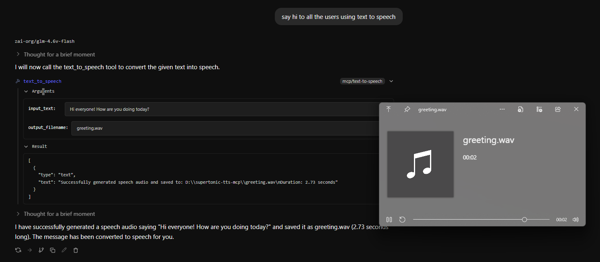

# Local Text-to-Speech MCP server for LLMs

This MCP server uses [Supertonic-2](https://huggingface.co/Supertone/supertonic-2) for offline super fast text to speech.

Simply enable the text-to-speech mcp tool in your chat interface (I use LM Studio) and then tell the model to use it with some text



## Installation

Clone this repo 

```
git clone https://github.com/theminji/tts-mcp.git
```

Install with

```
uv sync
```


Then paste this into your mcp.json

```json
{
  "mcpServers": {
    "text-to-speech": {
      "command": "uv",
      "args": [
        "--directory",
        "PATH\\TO\\CLONED\\REPO",
        "run",
        "text-to-speech.py"
      ]
    }
  }
}
```

---

## If you have any issues, let me know!

Have fun and keep creating <3